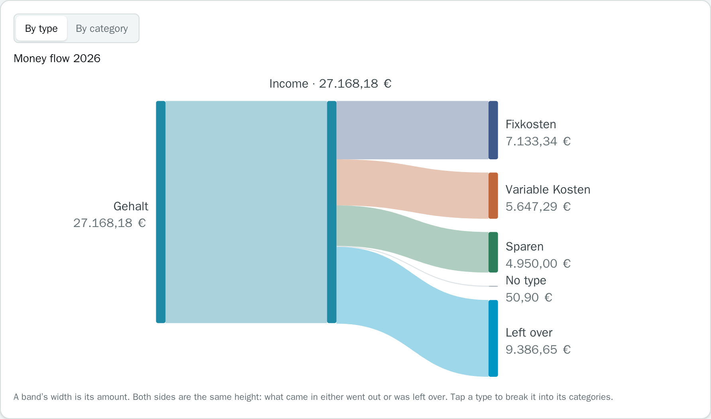
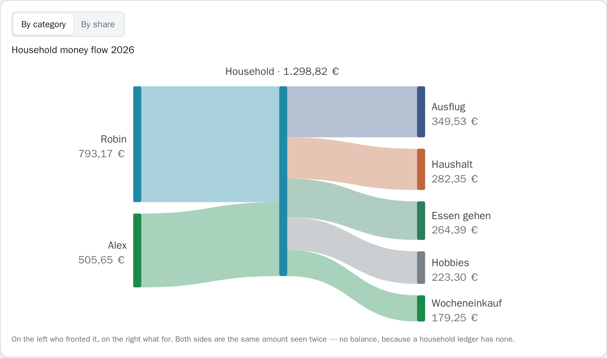

<p align="center">
  
</p>

<h1 align="center">Finanzen</h1>

<p align="center">
  <em>A household ledger that replaces the spreadsheet — and makes recording a booking a phone-sized job.</em>
</p>

<p align="center">
  
  
  
  
  
  
  
</p>

<div align="center">

This repo is rather for my personal use for tracking my finances over the years. There are already dozens of other financial trackers out there. However, if you find mine useful, feel free to use it, or even support me in the development:

<a href="https://www.paypal.com/donate/?hosted_button_id=KXMYX49C6MLLN">
  
</a>

</div>

---

A spreadsheet handled the categorisation, the net arithmetic, the tax sheet and the
charts. What it could not do was record a booking in a shop, on a phone, in ten
seconds. That is what this replaces.

The spreadsheet's arithmetic is the specification: every figure is recomputed from
the raw columns rather than read out of a formula cell, and the test suite asserts
the app reproduces it exactly. The UI ships in German and English; amounts and dates
always render de-DE.

## Features

- **Quick add** — cents-first keypad, comment picked from your most frequent
  bookings, category predicted in the browser from the rule table. No server round
  trip; you can always override.
- **Net figures** — a category shows expenses minus income of the *same* category,
  both legs visible. Rent nets to 3.960 € when a flatmate pays half of 7.920 €.
- **Three savings figures** — what you paid into savings categories (checkable
  against a bank statement), how much income you did not consume, and the
  spreadsheet's own rate as a footnote.
- **Month by month** — per category or per comment. Click a category to chart it,
  expand the bookings behind any bar in place.
- **Money flow** — a year or a single month as a flow diagram: income, one total,
  then out into cost buckets or what was left. The household ledger gets the same
  diagram for who fronted what.
- **Rules and overrides** — a rule table maps comments; a manual assignment on one
  booking wins. Editing a rule recategorises the past and reports how many bookings
  moved.
- **Import .xlsx / .ods** — preview before committing, then a review queue for
  comments no rule knows, sorted by frequency, one keystroke per decision.
- **Tax** — flag bookings, attach receipt photos, export CSV or PDF.
- **Recurring templates** — the fixed monthly items in two taps. Amounts marked as
  estimates materialise as drafts, never as confirmed bookings.
- **KitchenOwl** — shared household expenses as a separate, parallel ledger. Every
  figure is a pair (household total and your share); never summed with personal
  bookings, never auto-booked.
- **Privacy mode** — masks every amount while categories, counts and chart shapes
  stay intact.
- **Multiple users** — isolation enforced by Postgres row-level security, not by
  handler discipline.

## A look around

| | |
|:--:|:--:|
| <a href="docs/screenshots/dashboard.png"></a> | <a href="docs/screenshots/monate.png"></a> |
| **Dashboard** — savings paid in, beside income kept | **Monthly overview** — the line stops at the last month with data |
| <a href="docs/screenshots/auswertung.png"></a> | <a href="docs/screenshots/buchungen.png"></a> |
| **Analysis** — any category or comment across twelve months | **Bookings** — filter by year, text or category; edit in place |
| <a href="docs/screenshots/geldfluss.png"></a> | <a href="docs/screenshots/haushalt-fluss.png"></a> |
| **Money flow** — in, through one total, back out | **Household flow** — who fronted it, and what for |
| <a href="docs/screenshots/quickadd.png"></a> | <a href="docs/screenshots/mobil.png"></a> |
| **Quick add** — the reason the project exists | **Mobile** — tables become cards |
| <a href="docs/screenshots/steuer.png"></a> | |
| **Tax** — receipt list with camera upload and CSV/PDF export | |

<sub>Every screenshot shows invented sample data.</sub>

## Quick start

```bash
git clone https://github.com/n1tr0-5urf3r/finanzen.git finanzen && cd finanzen
cp .env.example .env
$EDITOR .env          # APP_PUBLIC_URL, APP_SESSION_SECRET and both DB passwords
docker compose up -d
```

Finish setup in the browser. Registration closes afterwards; further accounts are
created by the first account under **Settings**.

Behind a TLS proxy, `nginx.finanzen.conf` is a working example. `APP_PUBLIC_URL`
must be the exact public https URL — the session cookie's `Secure` flag and the
CSRF check both derive from it.

To run the published image instead of building, drop the `build:` block and point
`CONTAINER_IMAGE` at the package CI pushes on every commit to the default branch:

```
CONTAINER_IMAGE=ghcr.io/n1tr0-5urf3r/finanzen
IMAGE_TAG=latest      # or sha-<commit> to pin
```

## Configuration

Everything via `.env`; `.env.example` is fully commented.

| Variable | Meaning |
|---|---|
| `APP_PUBLIC_URL` | Exact public URL. Drives the cookie flag and the CSRF check. |
| `APP_SESSION_SECRET` | At least 32 characters. Changing it signs everyone out. |
| `APP_DB_USER` / `APP_DB_PASSWORD` | The role the app connects as — **not** a superuser, or RLS would be inert. The app refuses to start in that case. |
| `AUTH_ALLOW_REGISTRATION` | Default `false`: accounts are created by the admin. |
| `KITCHENOWL_URL` / `KITCHENOWL_TOKEN` | Leave empty to disable the integration. |
| `KITCHENOWL_*_SECONDS` | Sync intervals. `0` switches a loop off; the minimum is otherwise 60 s. |
| `IMPORT_FUZZY_MIN_CONFIDENCE` | Default `0.92`. Lower yields suggestions that get accepted by reflex and are wrong. |
| `DATA_ROOT` | Where the database and receipts live on the host. Default `./data`. |

## Backup

Everything lives under `DATA_ROOT` (default `./data`) as plain host directories,
`postgres/` and `receipts/`.

**Do not copy `data/postgres` while the server runs** — those files are only
consistent when it is stopped, and a live copy may refuse to start on the day you
need it. `deploy/backup.sh` takes a consistent dump instead and tars the receipts
beside it:

```bash
deploy/backup.sh /srv/backups     # finanzen_<date>.sql.gz and receipts_<date>.tar.gz
```

The script prints the restore command when it finishes. To copy the directory as
it is, stop the stack first with `docker compose down`.

## License

Copyright © 2026 Fabian Ihle.

This financial tracker is free software licensed under the
[GNU Affero General Public License v3.0 only](LICENSE) (`AGPL-3.0-only`). If you
run a modified version as a network service, its users must be offered the
corresponding source under the same license.

---
