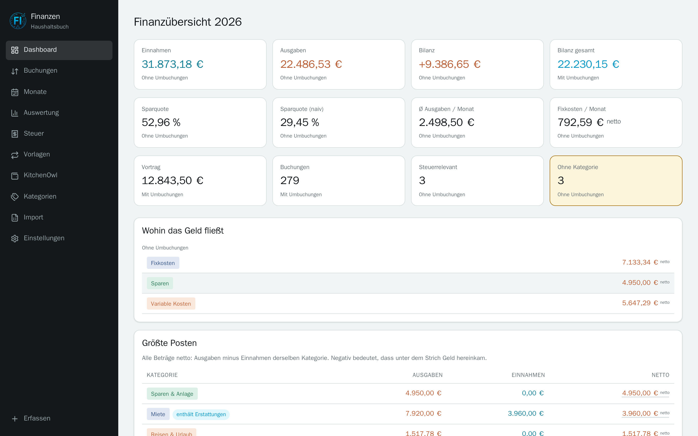
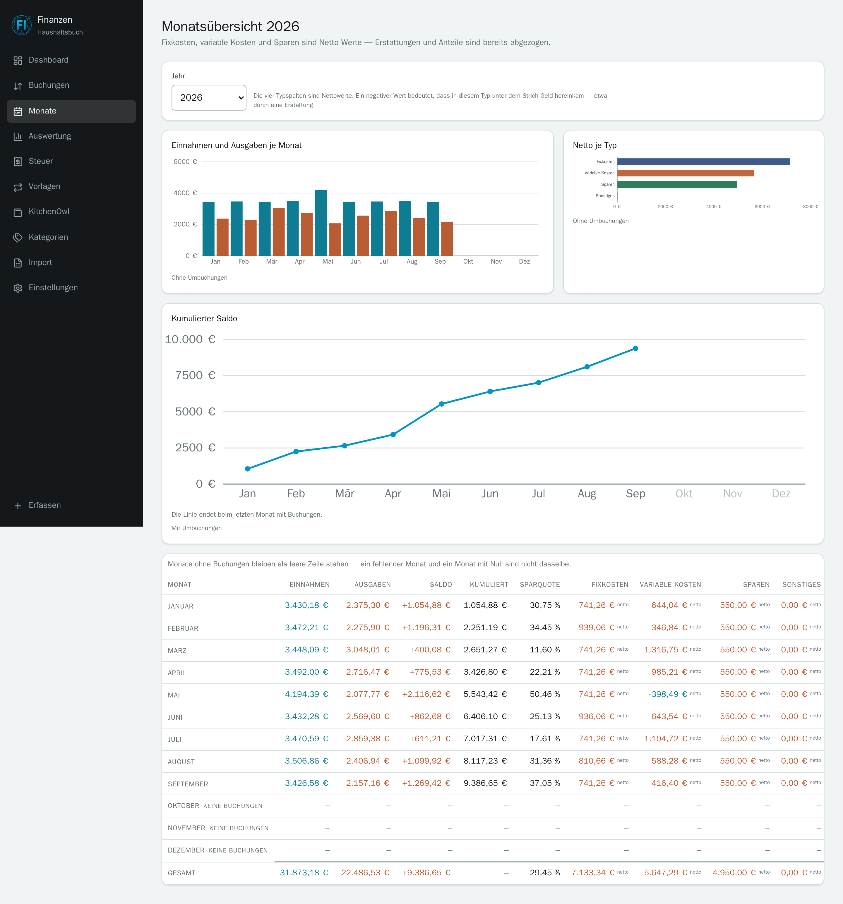
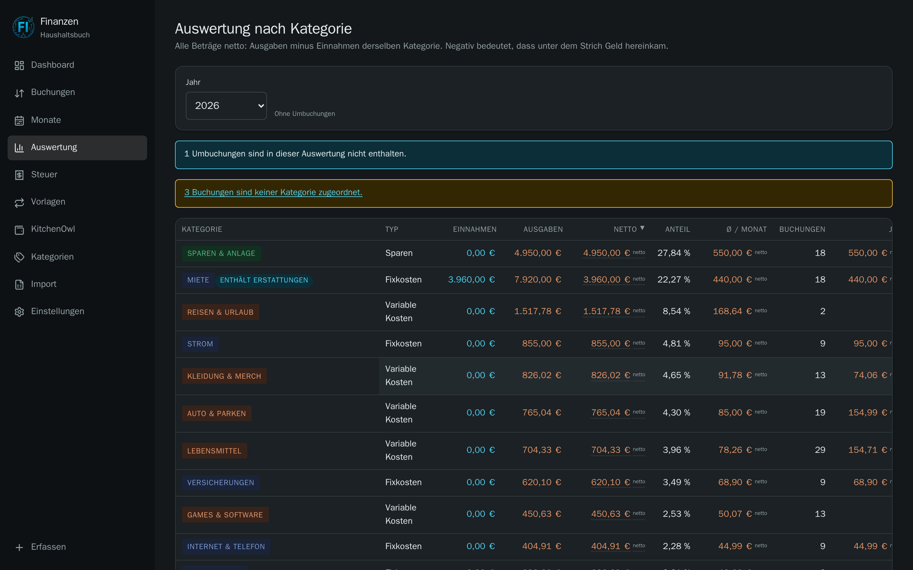
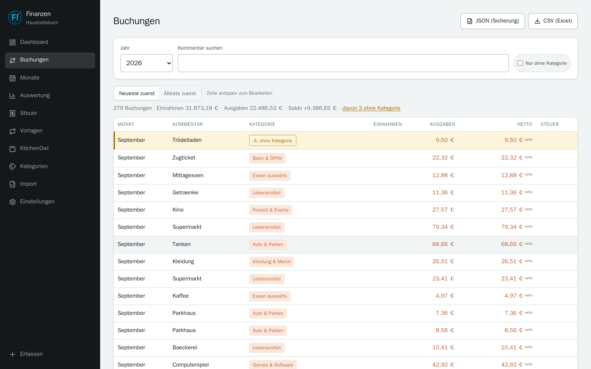
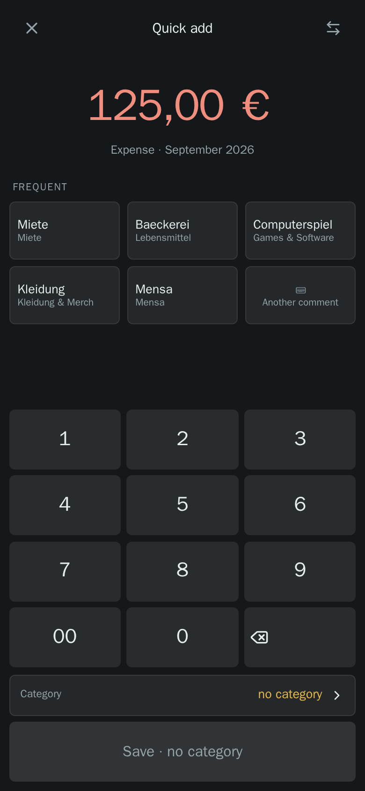
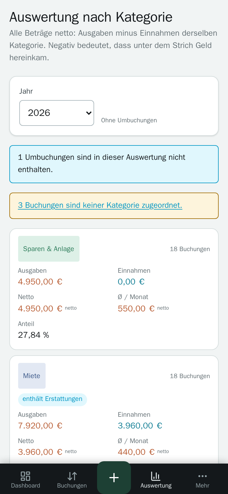
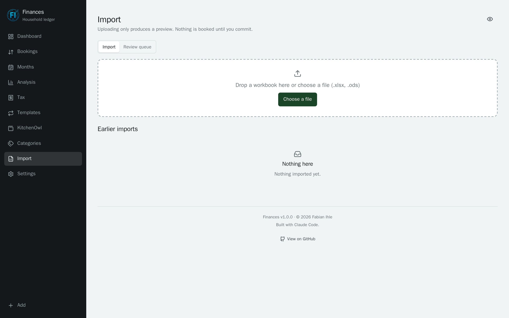
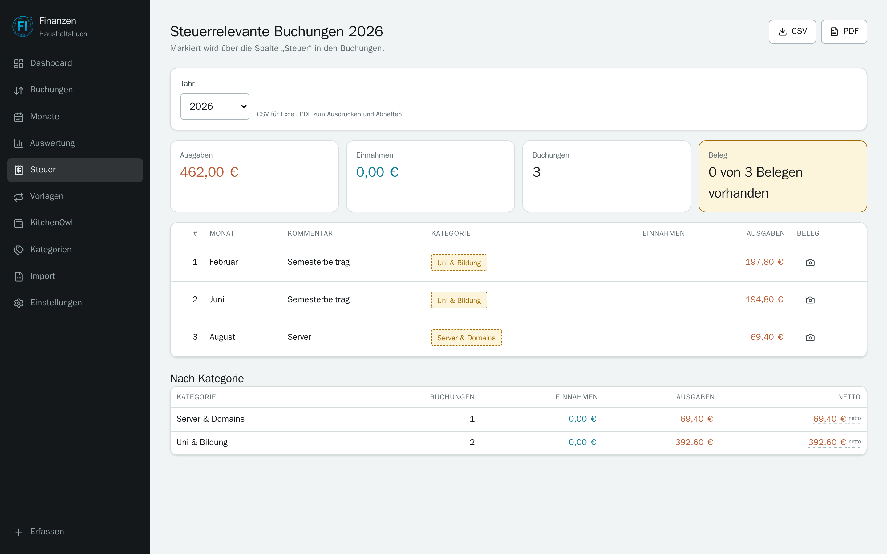

<p align="center">
  
</p>

<h1 align="center">Finanzen</h1>

<p align="center">
  <em>A household ledger that replaces the spreadsheet — and finally makes recording a booking a phone-sized job.</em>
</p>

<p align="center">
  
  
  
  
  
  
  
</p>

---

The spreadsheet could do everything — two-layer categorisation, net arithmetic, a tax
sheet, charts. The one thing it could not do is the thing that happens most often:
record a booking in a shop, on a phone, in ten seconds. That is what this project is
for.

**The spreadsheet's arithmetic is the specification.** Every figure was recomputed
from the raw columns rather than read out of the formula cells, and the test suite
asserts that the app reproduces it exactly.

The interface ships in German and English; amounts and dates always render de-DE,
because that is the format the data was recorded in.

## What it does

- **Quick add in three taps** — the amount on a cents-first keypad, the comment from
  your own most frequent bookings, done. The category is predicted by the rule table
  in the browser, with no server and no connection; you can still pick one yourself
  at any point.
- **Net everywhere** — a category shows expenses *minus income of the same category*.
  Rent reads 3,960 € net because a flatmate pays half of the 7,920 € that actually
  left the account. Both figures stay visible, and the sign always says direction:
  green and a `+` for money in, red and a `−` for money out.
- **Three savings figures, not one** — what you actually paid into the savings
  categories (the one you can check against a bank statement), how much of real
  income you did not consume, and the spreadsheet's own rate kept as a footnote
  because it understates the truth by 26 points.
- **Month by month, per category or per comment** — "how much do I spend on fuel,
  and is it getting worse". Click a category in the table to chart it, then expand
  the bookings behind any bar without leaving the page.
- **Two-layer categorisation** — a rule table maps comments; a manual assignment on a
  single booking overrides it. Changing a rule recategorises the past as well, and
  says how many bookings it moved.
- **Import from .xlsx and .ods** — with a preview before committing, and a review
  queue for comments no rule knows: sorted by frequency, one decision per comment,
  by keyboard.
- **Tax** — flag bookings, photograph receipts, export as CSV or PDF.
- **Recurring templates** — the eighteen items that are the same every month, booked
  in two taps instead of eighteen.
- **KitchenOwl** — the household's shared expenses as a *separate* ledger of their
  own, with an analysis of its own: same questions, same tables, but every figure
  is a pair — what the household spent and your share of it — and the two are never
  added. Never netted against the personal bookings, and matching one up never
  books anything by itself.
- **Privacy mode** — one eye button in the header masks every euro figure while
  categories, months, counts and the shape of every chart stay exactly as they
  were. For a screen someone else can see.
- **Multiple users** — separate data, enforced by row-level security in the database
  rather than by handler discipline.

## A look around

| | |
|:--:|:--:|
| <a href="docs/screenshots/dashboard.png"></a> | <a href="docs/screenshots/monate.png"></a> |
| **Dashboard** — what you paid into savings, beside how much of your income you kept | **Monthly overview** — the line ends at the last month with bookings instead of running on flat |
| <a href="docs/screenshots/auswertung.png"></a> | <a href="docs/screenshots/buchungen.png"></a> |
| **Analysis** — any category or comment across twelve months, with the bookings one click away | **Bookings** — filter by year, text or category; edit in place; uncategorised rows stay flagged |
| <a href="docs/screenshots/quickadd.png"></a> | <a href="docs/screenshots/mobil.png"></a> |
| **Quick add** — the reason the project exists | **Mobile** — tables become cards, and nothing is ever wider than the screen |
| <a href="docs/screenshots/pruefliste.png"></a> | <a href="docs/screenshots/steuer.png"></a> |
| **Review queue** — 238 unknown comments, sorted by frequency | **Tax** — receipt list with camera upload and CSV/PDF export |

<sub>Every screenshot shows invented sample data.</sub>

## Quick start

```bash
git clone https://github.com/n1tr0-5urf3r/Finanzen.git finanzen && cd finanzen
cp .env.example .env
$EDITOR .env          # APP_PUBLIC_URL, APP_SESSION_SECRET and both DB passwords
docker compose up -d
```

Then complete first-run setup in the browser. Registration is closed afterwards;
further accounts are created by that first account under **Settings**.

Behind a TLS proxy: `nginx.finanzen.conf` is a working example. `APP_PUBLIC_URL` must
be the exact public https URL — the session cookie's `Secure` flag and the CSRF check
both depend on it.

## Configuration

Everything via `.env`; `.env.example` is fully commented.

| Variable | Meaning |
|---|---|
| `APP_PUBLIC_URL` | Exact public URL. Drives the cookie flag and the CSRF check. |
| `APP_SESSION_SECRET` | At least 32 characters. Changing it signs everyone out. |
| `APP_DB_USER` / `APP_DB_PASSWORD` | The role the app connects as — **not** a superuser, or RLS would be inert. The app refuses to start in that case. |
| `AUTH_ALLOW_REGISTRATION` | Default `false`: accounts are created by the admin. |
| `KITCHENOWL_URL` / `KITCHENOWL_TOKEN` | Leaving them empty disables the integration entirely. |
| `KITCHENOWL_*_SECONDS` | Sync intervals. `0` switches a loop off; otherwise the minimum is 60 s. |
| `IMPORT_FUZZY_MIN_CONFIDENCE` | Default `0.92`. Lower produces suggestions you accept reflexively and that are wrong. |

## License

[GNU AGPL-3.0-only](LICENSE). The Affero clause is the point: if you run a modified
copy of this where other people can reach it, they are entitled to its source.
A household ledger is exactly the kind of thing that gets forked, hosted and
quietly closed, and this is the licence that says no to that.

© 2026 Fabian Ihle
